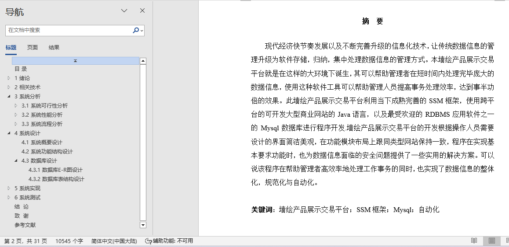
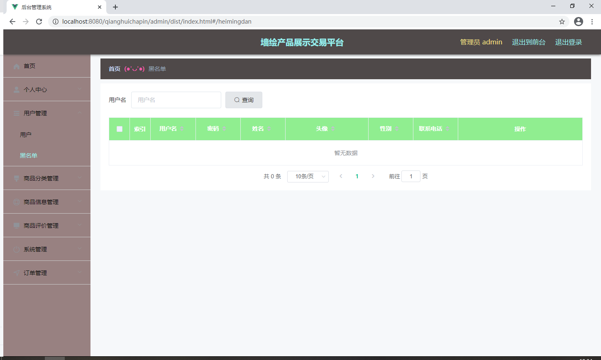
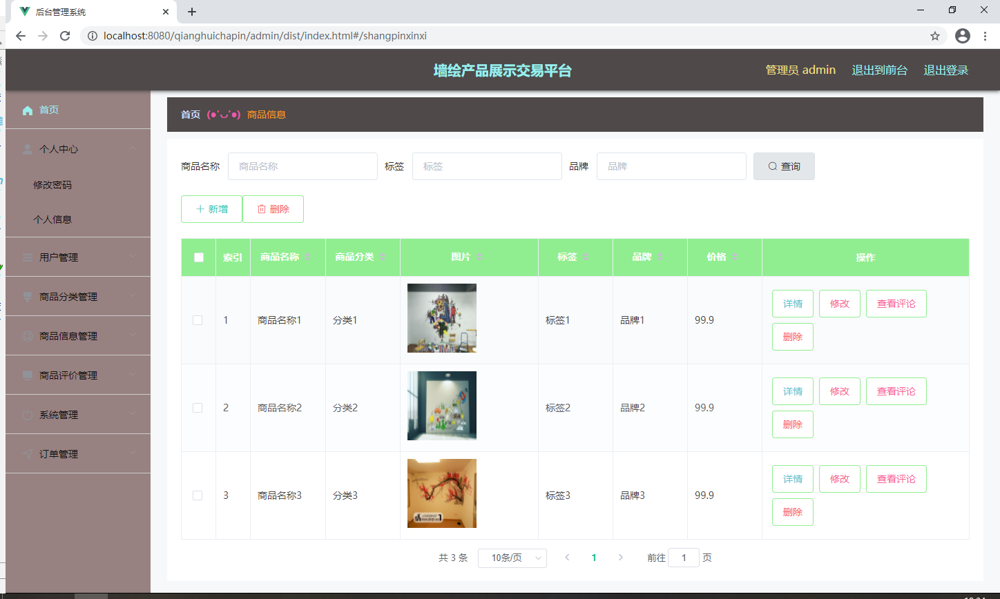
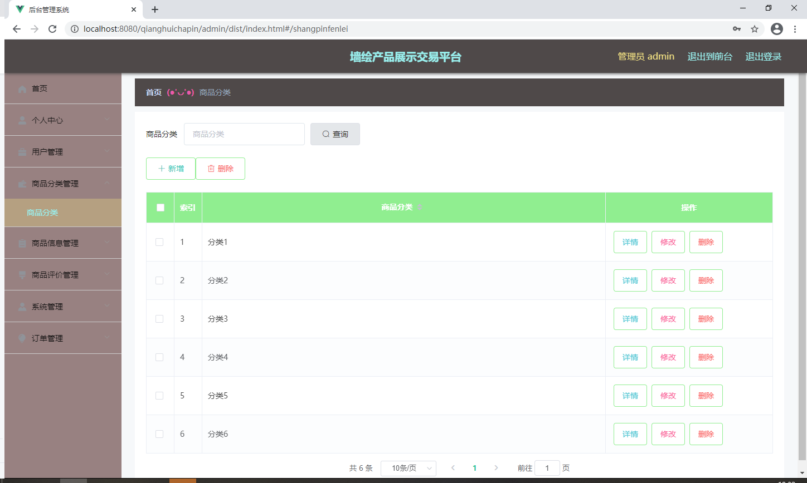
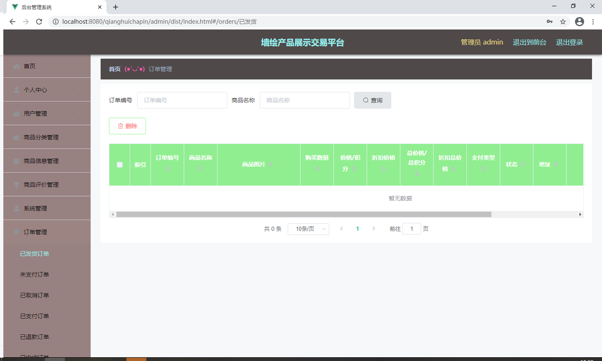
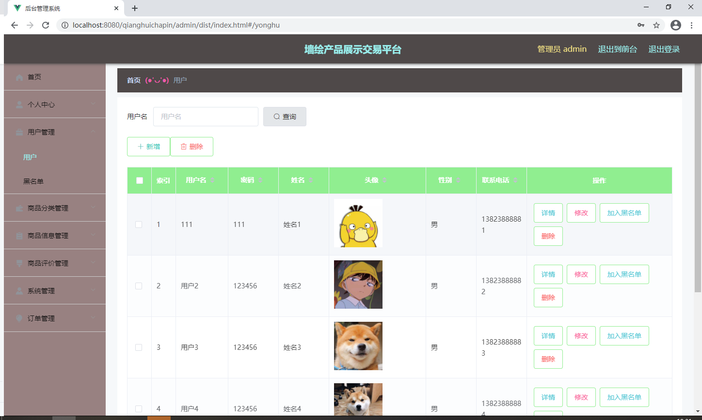

## 基于SpringBoot的墙绘产品展示交易平台(程序+报告)

- <b>完整代码获取地址：从戎源码网 ([https://armycodes.com/](https://armycodes.com/))</b>
- <b>技术探讨、资料分享，请加QQ群：692619798</b> 
- <b>作者微信：19941326836  QQ：952045282</b> 
- <b>承接计算机毕业设计、Java毕业设计、Python毕业设计、深度学习、机器学习</b>
- <b>选题+开题报告+任务书+程序定制+安装调试+论文+答辩ppt 一条龙服务</b>
- <b>所有选题地址 ([https://github.com/YuLin-Coder/AllProjectCatalog](https://github.com/YuLin-Coder/AllProjectCatalog)) </b>

## 项目介绍
基于SpringBoot的墙绘产品展示交易平台，系统包含两种角色：用户、管理员，系统分为前台和后台两大模块，主要功能如下：

用户信息管理
用户信息管理页面提供给管理员的功能有：用户信息的查询管理，可以删除用户信息、修改用户信息、新增用户、将用户加入黑名单或取消黑名单，并支持对用户名称的模糊查询条件。

商品信息管理
商品信息管理页面提供给管理员的功能有：查看已发布的商品信息数据，修改商品信息，商品信息作废即删除。

商品分类管理
商品分类管理页面提供给管理员的功能有：根据商品分类进行条件查询，并可对商品分类进行新增、修改、查询等操作。

订单管理
订单管理页面提供给管理员的功能有：根据订单信息进行新增、修改、查询等操作。

## 项目技术
- 编程语言：Java
- 数据库：MySQL
- 项目管理工具：Maven
- 前端技术：HTML、CSS、JavaScript、Jquery、Vue
- 后端技术：Spring、SpringMVC、MyBatis

## 运行环境
- JDK版本：JDK1.8及以上
- 开发工具：IDEA、Ecplise、Myecplise都可以
- 数据库: MySQL5.7及以上
- Maven：maven3.0及以上
- Node：14.14.0及以上

## 运行截图

